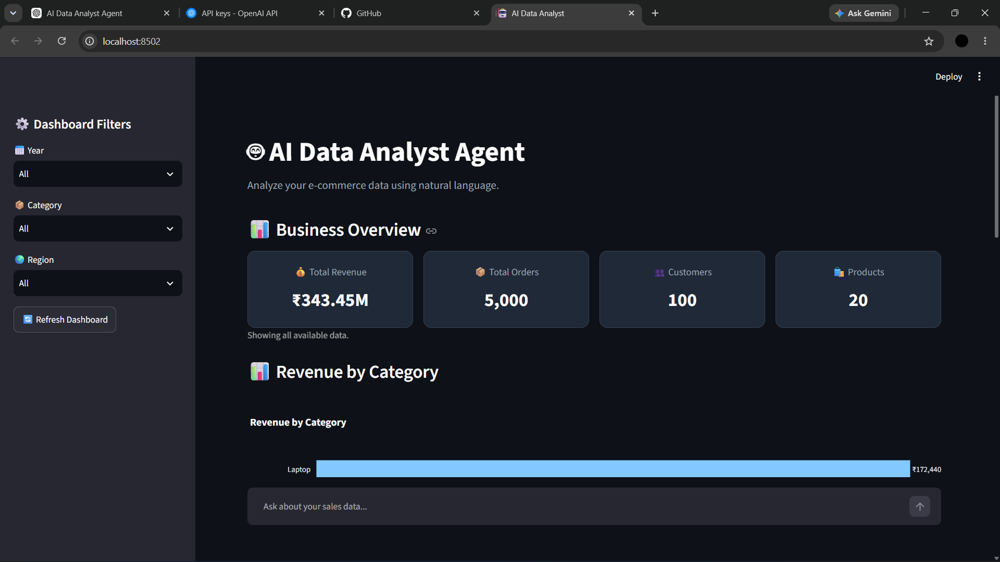
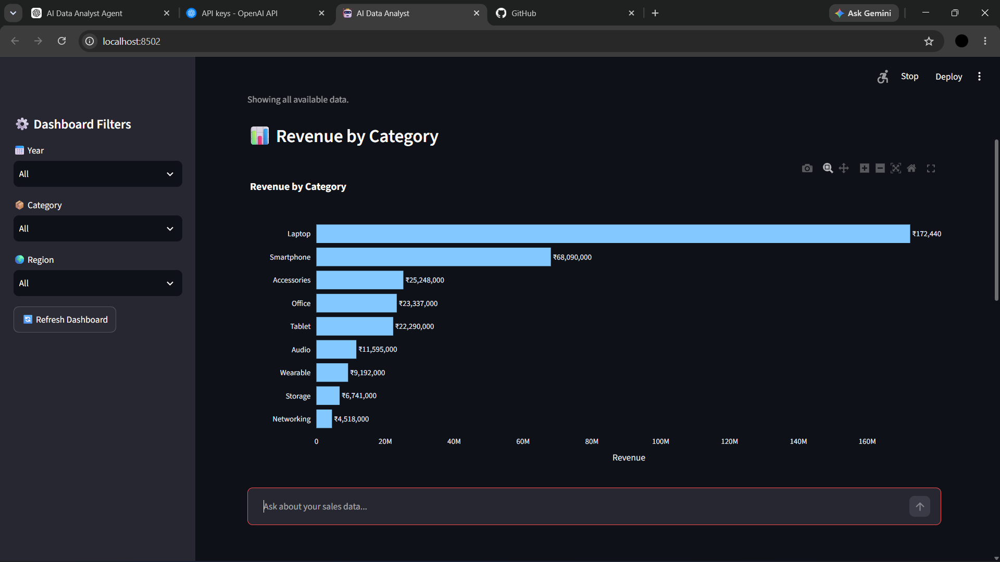
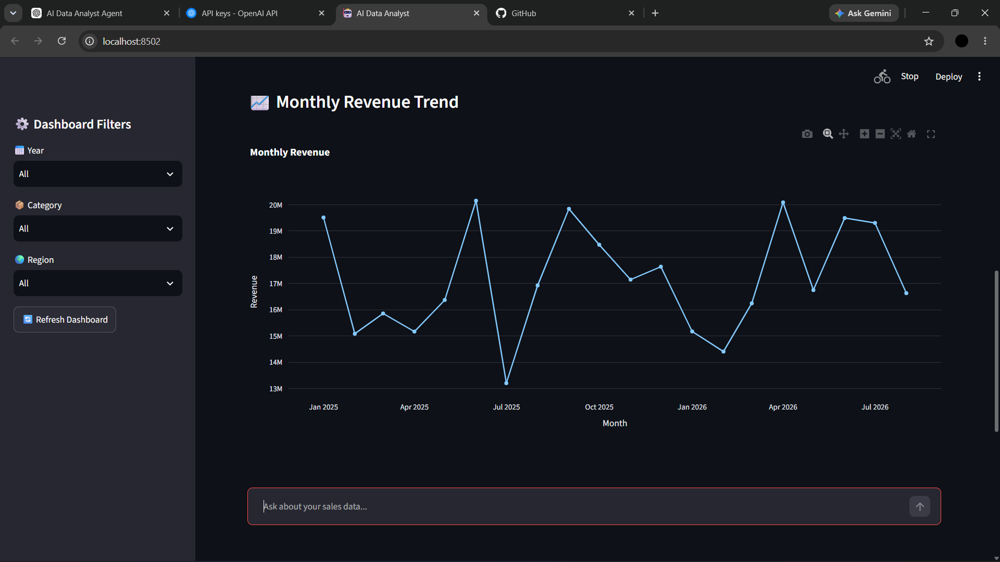
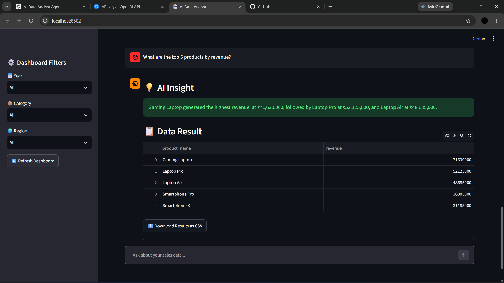
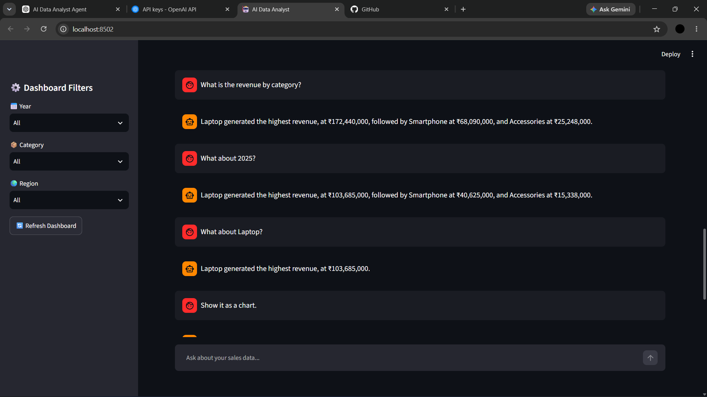

#  AI Data Analyst Agent

An AI-powered data analysis agent that allows users to explore e-commerce sales data using natural language.

Instead of writing SQL queries manually, users can ask questions such as:

> "What are the top 5 products by revenue?"

The agent understands the question, routes it through a LangGraph workflow, generates and validates SQL, executes it against a SQLite database, performs data analysis, creates visualizations when required, and returns a concise business insight.

---

##  Demo

###  Interactive Dashboard



Interactive dashboard with KPIs, filters, revenue analysis, and natural-language querying.

---

###  Revenue by Category



Visualize revenue distribution across different product categories.

---

###  Monthly Revenue Trend



Analyze monthly revenue patterns across 2025 and 2026.

---

###  AI Data Analysis



Ask business questions in natural language and receive structured data results and AI-generated insights.

---

###  Conversational Memory



The agent maintains context across follow-up questions, allowing users to refine their analysis naturally.

---

##  Key Features

- 💬 **Natural Language Data Analysis**
- 🤖 **Ollama + Qwen3:8b**
- 🧠 **LangGraph Agent Workflow**
- 🔀 **Intelligent Question Routing**
- 📝 **Natural Language → SQL Generation**
- ✅ **SQL Validation and Safety Checks**
- 🔄 **SQL Error Recovery and Retry**
- 🧮 **Deterministic Data Analysis**
- 📊 **Dynamic Chart Generation**
- 💡 **Business Insight Generation**
- 🧠 **Conversational Follow-up Memory**
- 🎛️ **Interactive Dashboard Filters**
- 📥 **CSV Data Export**
- 🗄️ **SQLite Database**
- 🌐 **Streamlit Web Interface**

---

Architecture

```text
                         ┌─────────────────────┐
                         │        User         │
                         │ Natural Language    │
                         │      Question       │
                         └──────────┬──────────┘
                                    │
                                    ▼
                         ┌─────────────────────┐
                         │    Streamlit UI     │
                         │ Dashboard + Chat    │
                         └──────────┬──────────┘
                                    │
                                    ▼
                         ┌─────────────────────┐
                         │ Conversation Memory │
                         │ Follow-up Context   │
                         └──────────┬──────────┘
                                    │
                                    ▼
                         ┌─────────────────────┐
                         │     LangGraph       │
                         │   Agent Workflow    │
                         └──────────┬──────────┘
                                    │
                                    ▼
                         ┌─────────────────────┐
                         │  Question Router    │
                         │ SQL / Analysis /    │
                         │      Chart          │
                         └──────────┬──────────┘
                                    │
                                    ▼
                         ┌─────────────────────┐
                         │   Qwen3:8b /        │
                         │      Ollama         │
                         └──────────┬──────────┘
                                    │
                                    ▼
                         ┌─────────────────────┐
                         │    SQL Generator    │
                         └──────────┬──────────┘
                                    │
                                    ▼
                         ┌─────────────────────┐
                         │    SQL Validator    │
                         │ SELECT-only Safety  │
                         └──────────┬──────────┘
                                    │
                                    ▼
                         ┌─────────────────────┐
                         │     SQLite DB       │
                         │  E-commerce Data   │
                         └──────────┬──────────┘
                                    │
                    ┌───────────────┼───────────────┐
                    ▼               ▼               ▼
             ┌────────────┐ ┌────────────┐ ┌────────────┐
             │  Analysis  │ │   Charts   │ │  Insights  │
             │    Tool    │ │    Tool    │ │    Tool    │
             └──────┬─────┘ └──────┬─────┘ └──────┬─────┘
                    │               │               │
                    └───────────────┼───────────────┘
                                    ▼
                         ┌─────────────────────┐
                         │    Final Response   │
                         │ Data + Insight +     │
                         │ Visualization       │
                         └─────────────────────┘


Project Structure

AI-Data-Analyst-Agent/
│
├── app/
│   ├── agent/
│   │   ├── graph.py
│   │   ├── router.py
│   │   ├── sql_agent.py
│   │   ├── llm.py
│   │   └── memory.py
│   │
│   ├── tools/
│   │   ├── sql_tool.py
│   │   ├── analysis_tool.py
│   │   ├── chart_tool.py
│   │   └── insight_tool.py
│   │
│   ├── database/
│   │   └── schema.py
│   │
│   └── ui/
│       ├── app.py
│       └── dashboard.py
│
├── data/
│   └── ecommerce.db
│
├── screenshots/
│   ├── dashboard.png
│   ├── revenue-by-category.png
│   ├── monthly-revenue.png
│   ├── ai-analysis.png
│   └── conversational-memory.png
│
├── requirements.txt
├── .gitignore
└── README.md
